# My LAMP Server Security Lab

In this project, I installed and configured a LAMP stack on an Ubuntu Server virtual machine. LAMP stands for Linux, Apache, MySQL, and PHP. I then applied basic security hardening before testing the server with security scans and controlled attack simulations from a separate lab machine.

My server is named `lamp01` and runs in UTM on my Mac.

## Part 1: Installed the LAMP stack

### Prerequisite: Created the Ubuntu virtual machine

I installed Ubuntu Server 24.04.5 ARM64 in UTM and named it `lamp01`. I then ran these commands to check the new server:

```bash
whoami
hostname
ip -br address
systemctl --failed --no-pager
```

I ran these commands to confirm who I was logged in as, the server's name, its network address, and whether any services had failed. The results showed the user `aliaops`, hostname `lamp01`, private IP address `192.168.64.3`, and zero failed services. This meant the Ubuntu VM was healthy and ready for the LAMP installation.

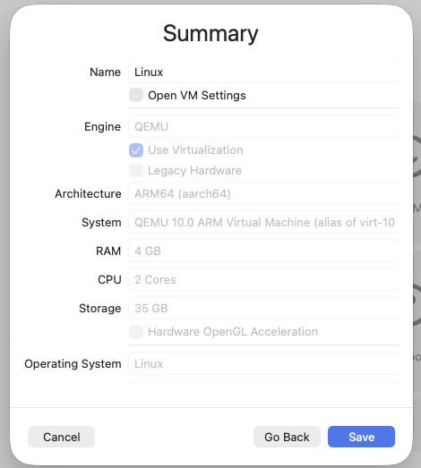

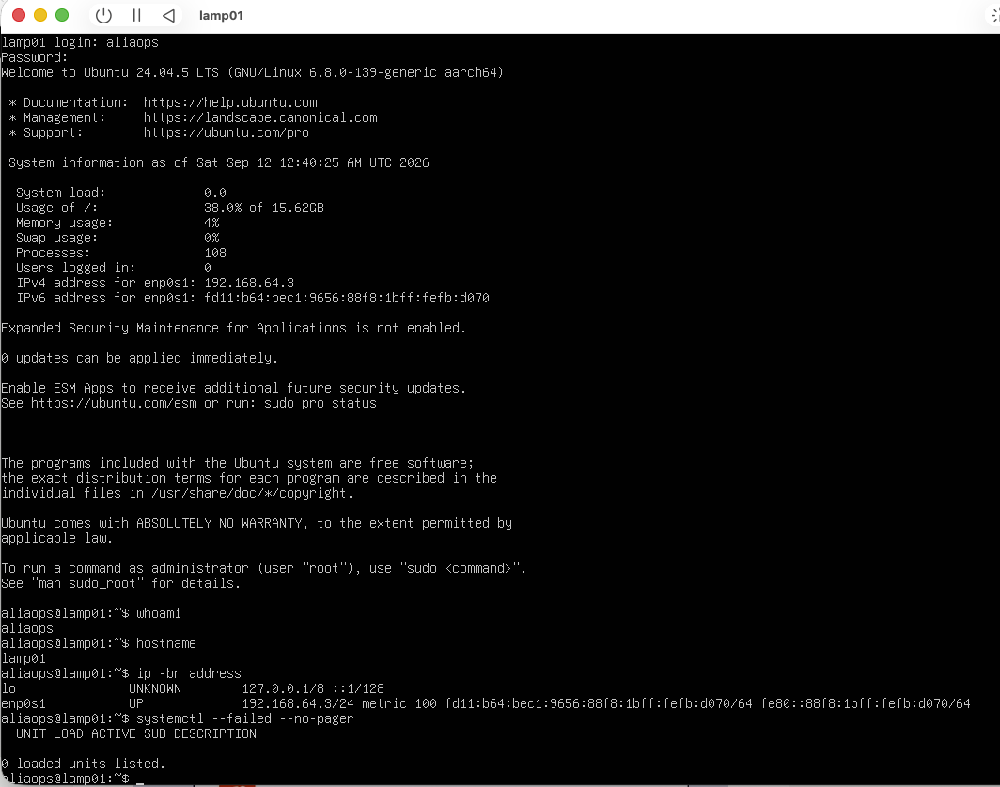

### Step 1: Updated Ubuntu

I ran:

```bash
sudo apt update && sudo apt upgrade -y
```

I ran `apt update` to download the latest package information and `apt upgrade` to install available updates. The commands completed successfully. This meant I was building the server with current bug fixes and security patches instead of outdated software.

### Step 2: Installed Apache

Apache is the web-server part of LAMP. I ran:

```bash
sudo apt install apache2 -y
sudo systemctl start apache2
sudo systemctl enable apache2
```

I installed Apache, started it, and enabled it to start automatically whenever the server boots. The service check showed that Apache was active and enabled. This meant the web server was running now and would return automatically after a reboot.

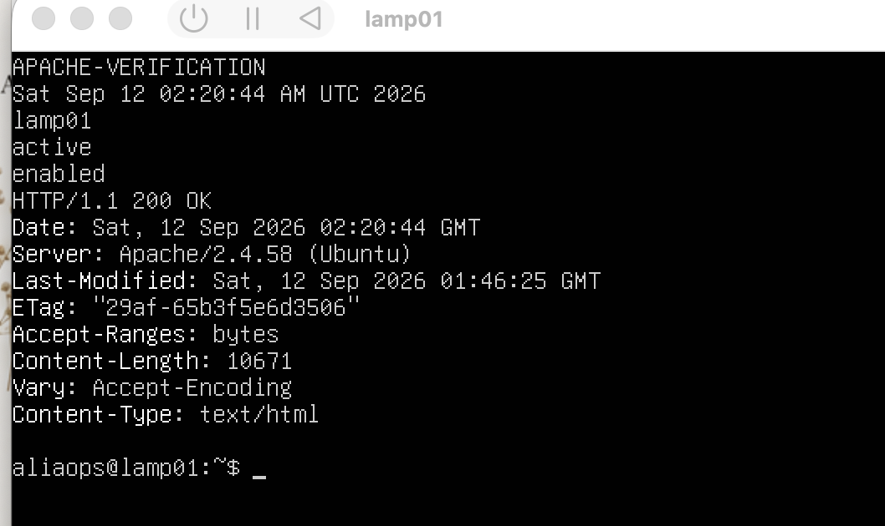

### Step 3: Installed MySQL

MySQL is the database part of LAMP. I ran:

```bash
sudo apt install mysql-server -y
sudo systemctl start mysql
sudo systemctl enable mysql
sudo mysql -e "SELECT VERSION();"
sudo mysql_secure_installation
```

I installed and started MySQL, checked its version, and ran `mysql_secure_installation` to remove unsafe default settings. MySQL returned its version and showed an active service. This meant the database server was installed correctly and its basic security setup was complete.

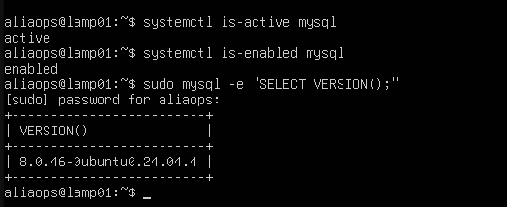

### Step 4: Installed PHP

PHP processes dynamic web content and connects Apache to MySQL. I ran:

```bash
sudo apt install php libapache2-mod-php php-mysql php-cli php-curl php-json -y
sudo systemctl restart apache2
echo '<?php phpinfo(); ?>' | sudo tee /var/www/html/info.php
```

I installed PHP and the modules that let it work with Apache and MySQL. I created a temporary PHP information page and opened it in a browser. The page loaded successfully, which meant Apache could process PHP code instead of displaying it as plain text.

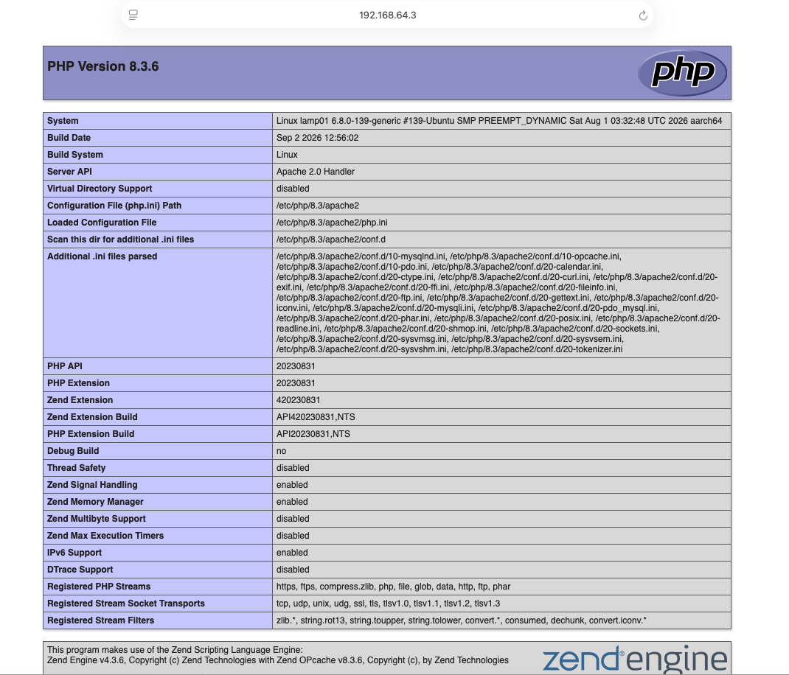

### Step 5: Configured the firewall

I allowed the three services needed for this lab and then enabled UFW:

```bash
sudo ufw allow OpenSSH
sudo ufw allow 80/tcp
sudo ufw allow 443/tcp
sudo ufw default deny incoming
sudo ufw default allow outgoing
sudo ufw enable
sudo ufw status verbose
```

I configured the firewall to allow only SSH on port 22, HTTP on port 80, and HTTPS on port 443. I set all other incoming connections to be denied by default. The firewall status showed that it was active with those rules, which meant unnecessary network access was blocked.

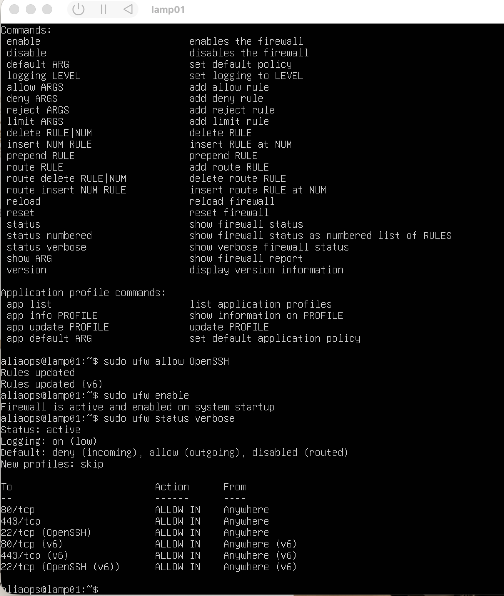

## Part 2: Hardened the server

### Hardening Step 1: Saved a pre-hardening copy

I cloned the working VM before making more security changes. The clone is named `lamp01-11-article-complete`.

I saved a copy of the working LAMP server before hardening it. The clone appeared in UTM as `lamp01-11-article-complete`. This meant I had a recovery point and could compare the original installation with the hardened version.

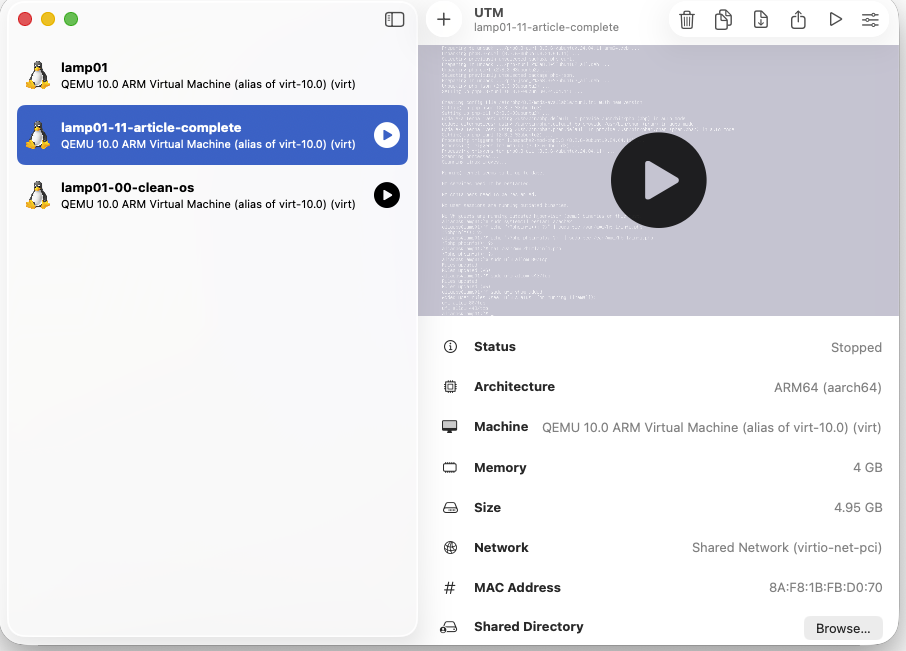

### Hardening Step 2: Removed the PHP test page

The PHP information page reveals details about the server, so I removed it after completing the test:

```bash
sudo rm /var/www/html/info.php
curl -I http://localhost/info.php
```

I removed the temporary `info.php` page because it displayed details that could help an attacker understand the server. I requested the page again and received `404 Not Found`. This meant the information page was no longer available.

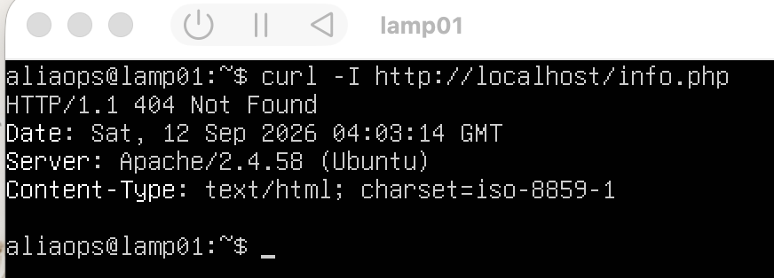

### Hardening Step 3: Hardened Apache

I made several small Apache changes:

- Hid detailed Apache version information.
- Turned off the server signature and TRACE method.
- Set the server name to `lamp01`.
- Disabled directory listings.
- Added three browser security headers.

I checked the configuration before reloading Apache:

```bash
sudo apache2ctl configtest
sudo systemctl reload apache2
```

I reduced the information Apache reveals, disabled directory listings and the unused TRACE method, and added browser security headers. I ran `apache2ctl configtest` before applying the changes and received `Syntax OK`. This meant Apache understood the configuration and it was safe to reload without breaking the website.

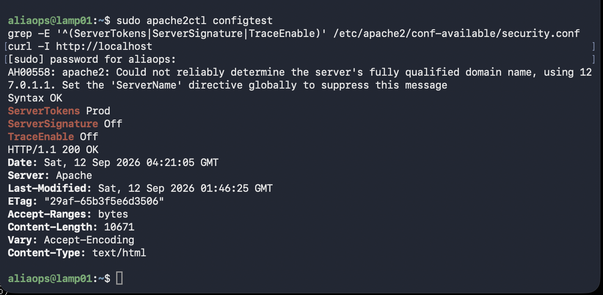

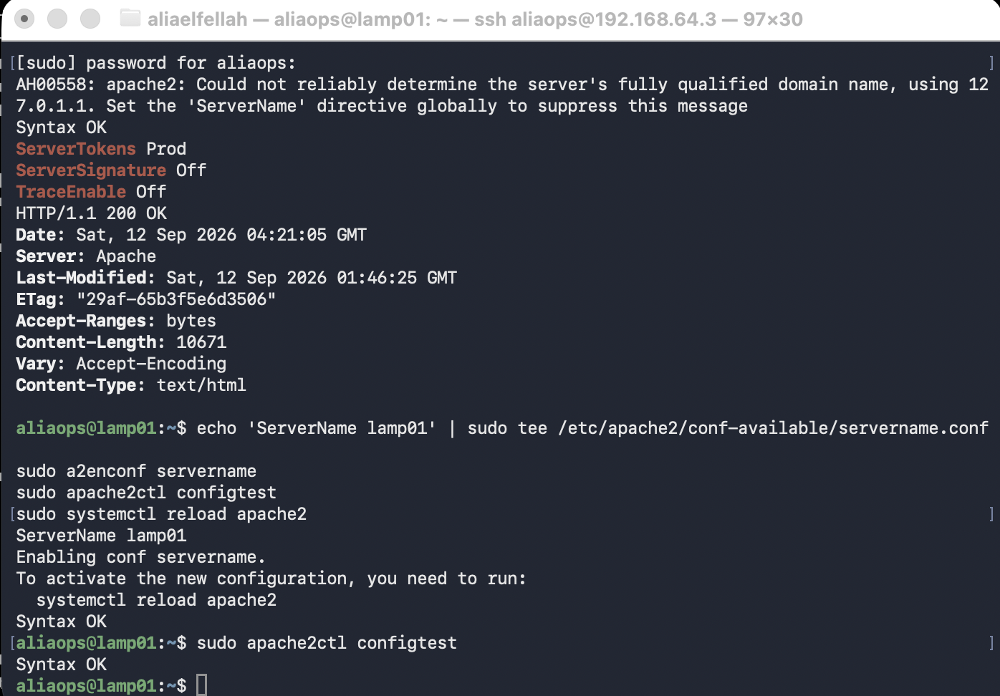

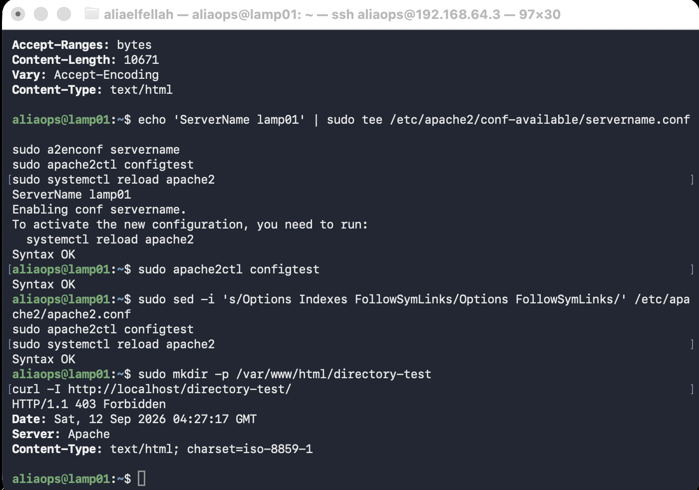

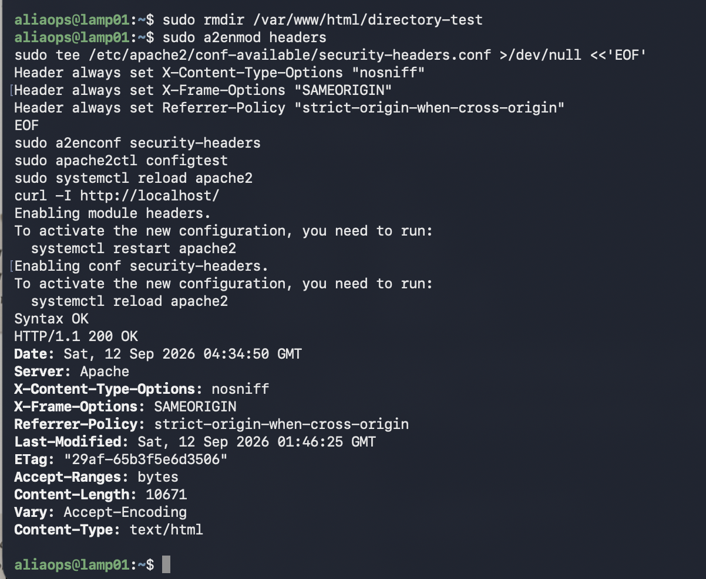

### Hardening Step 4: Hardened SSH

SSH lets me administer `lamp01` from my Mac Terminal. I blocked direct root login, limited login attempts, disabled unused graphical forwarding, and allowed only the `aliaops` account:

```text
PermitRootLogin no
MaxAuthTries 3
LoginGraceTime 30
X11Forwarding no
AllowUsers aliaops
```

I checked the configuration before reloading SSH:

```bash
sudo sshd -t
sudo systemctl reload ssh
```

I tightened SSH so root could not log in directly, only `aliaops` was allowed, and repeated login attempts were limited. I validated the configuration, reloaded SSH, and successfully opened a second connection. This meant the safer settings were active and I had not locked myself out of the server.

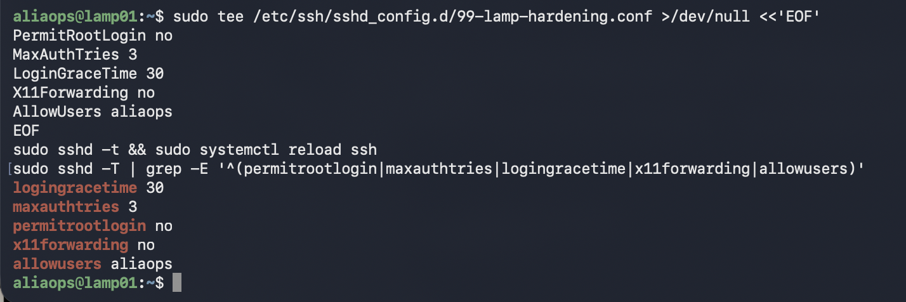

### Hardening Step 5: Restricted MySQL

The website and database are on the same VM, so MySQL does not need to accept connections from other computers. I ran:

```bash
sudo mysql -NBe "SHOW VARIABLES LIKE 'bind_address';"
sudo ss -lntp | grep 3306
```

I checked where MySQL was listening because the database did not need to be exposed to the network. The result showed `127.0.0.1:3306`, no anonymous or non-local accounts, and no listener on the unused port 33060. This meant MySQL accepted connections only from inside `lamp01`, reducing its network exposure.

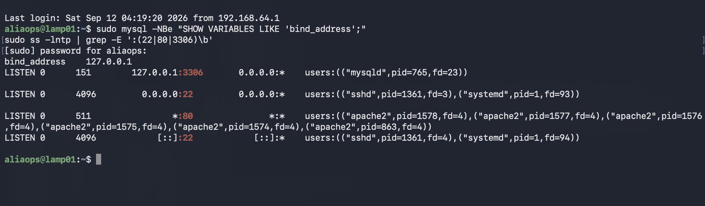

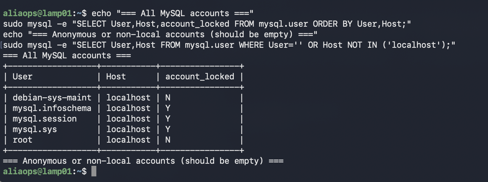

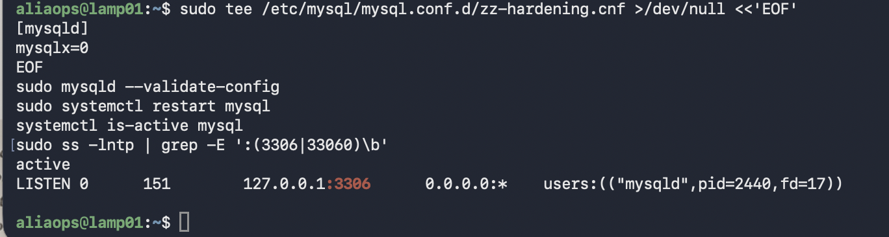

### Hardening Step 6: Enabled automatic security updates

```bash
sudo apt install unattended-upgrades -y
sudo systemctl enable --now unattended-upgrades
```

I installed and enabled unattended upgrades so Ubuntu could apply important security updates automatically. The checks returned `enabled` and `active`. This meant the update service would run automatically instead of depending entirely on manual updates.

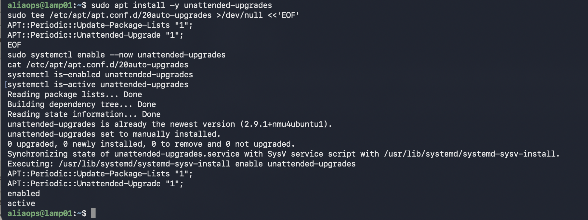

### Hardening Step 7: Protected SSH with Fail2ban

```bash
sudo apt install fail2ban -y
sudo systemctl enable --now fail2ban
sudo fail2ban-client status sshd
```

I installed Fail2ban to watch for repeated failed SSH logins and temporarily block the source. Its status showed one active jail named `sshd`; no addresses were banned during the check because there had been no failed attempts. This meant SSH monitoring was active and ready to respond to repeated failures.

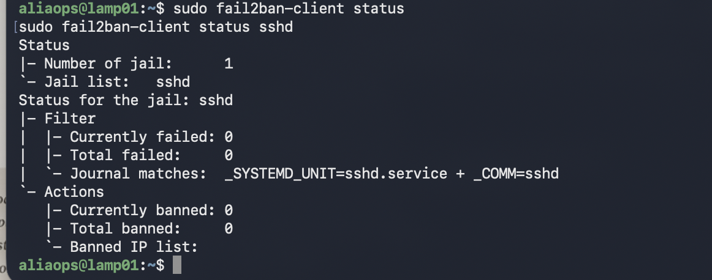

### Hardening Step 8: Checked AppArmor

```bash
systemctl is-enabled apparmor
systemctl is-active apparmor
sudo aa-status
```

I checked AppArmor, which limits what protected programs are allowed to access even if one is compromised. The results showed that AppArmor was enabled, active, and had profiles in enforce mode. This meant the operating system was actively applying those restrictions.

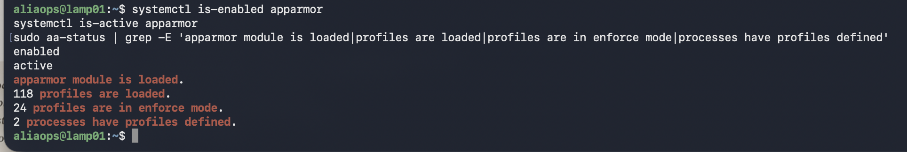

### Hardening Step 9: Protected the website files

```bash
sudo chown -R root:root /var/www/html
sudo find /var/www/html -type d -exec chmod 755 {} \;
sudo find /var/www/html -type f -exec chmod 644 {} \;
```

I made `root` the owner of the website and set directories to `755` and files to `644`. The verification showed those ownership and permission values. This meant Apache could read and serve the website, but its account could not rewrite the current files.

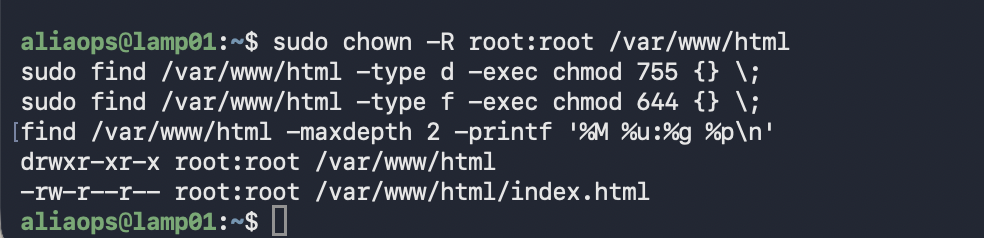

### Hardening Step 10: Enabled HTTPS

```bash
sudo a2enmod ssl
sudo a2ensite default-ssl
sudo apache2ctl configtest
sudo systemctl reload apache2
curl -kI https://localhost/
```

I enabled Apache's SSL module and HTTPS site, checked the configuration, and requested the page over HTTPS. I received `Syntax OK` and `HTTP/1.1 200 OK`, and Apache listened on port 443. This meant encrypted web access was working. The lab uses a self-signed certificate, so a browser warning is expected; a public site would need a trusted certificate.

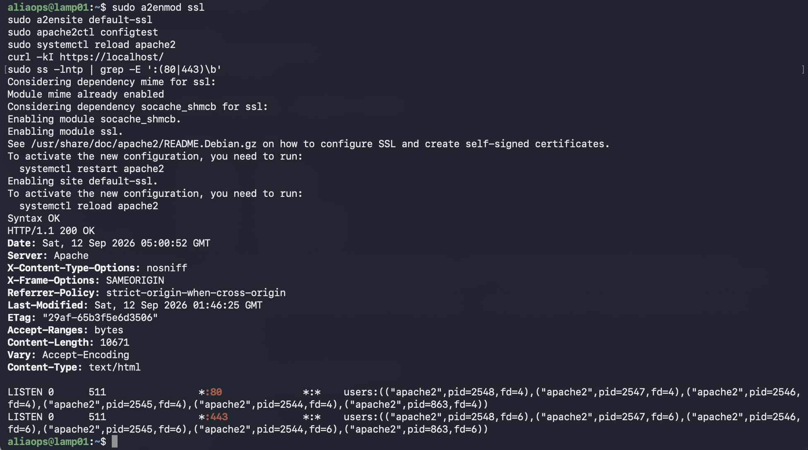

### Hardening Step 11: Hardened PHP

I configured PHP to hide its version, keep detailed errors out of the browser, log errors on the server, and protect future session cookies:

```ini
expose_php = Off
display_errors = Off
log_errors = On
session.cookie_httponly = 1
session.cookie_secure = 1
session.cookie_samesite = "Lax"
```

I changed PHP so it would not advertise its version or display detailed errors to visitors. I kept server-side error logging on and enabled safer cookie settings. The PHP check returned the hardened values, which meant the configuration was active after Apache restarted.

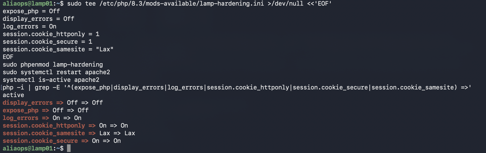

### Hardening Step 12: Enabled audit logging

```bash
sudo apt install auditd audispd-plugins -y
sudo systemctl enable --now auditd
sudo auditctl -s
```

I installed and enabled Auditd to record security-related operating-system events for later investigation. The results showed the service was enabled and active, with `lost 0`. This meant audit logging was running and had not dropped any records at the time of the check.

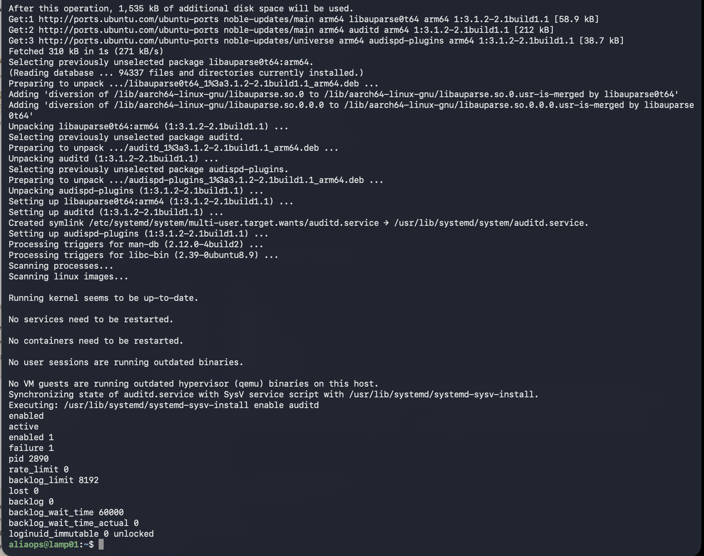

## Part 3: Tested and attacked the server in a controlled lab

I tested only my own LAMP server inside the private UTM lab network. The Parrot Security VM was the testing computer, and the hardened Ubuntu VM was the authorized target.

### Testing Step 1: Prepared Parrot Security

I imported the ARM64 Parrot Security VM into UTM and named it `parrot01`.

I used a separate Parrot Security VM so the tests came from another computer instead of from the server itself. The VM imported successfully in UTM. This gave me a dedicated testing machine while keeping the activity inside my own lab.

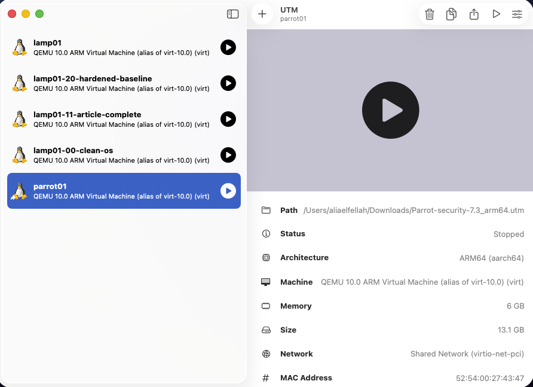

After updating and rebooting Parrot, I ran:

```bash
hostname
grep PRETTY_NAME /etc/os-release
ip -br address
ping -c 3 1.1.1.1
```

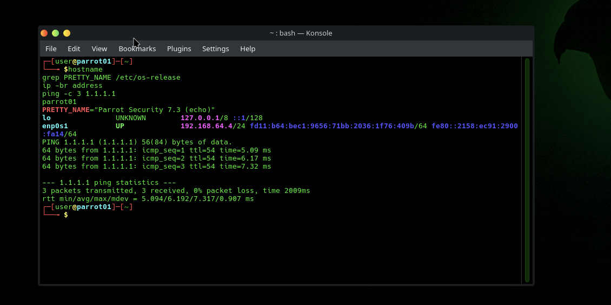

I ran these checks to confirm the testing VM's identity, operating system, address, and network connection. The results showed hostname `parrot01`, Parrot Security 7.3, IP address `192.168.64.4`, and zero packet loss to `1.1.1.1`. This meant the updated testing VM was working and ready.

### Testing Step 2: Checked connectivity to the server

The hardened LAMP server used `192.168.64.3`. I ran:

```bash
ping -c 3 192.168.64.3
```

I ran `ping` to check whether Parrot could reach the LAMP server before scanning it. All three packets received replies with zero packet loss. This meant the two lab machines could communicate and the target was online.

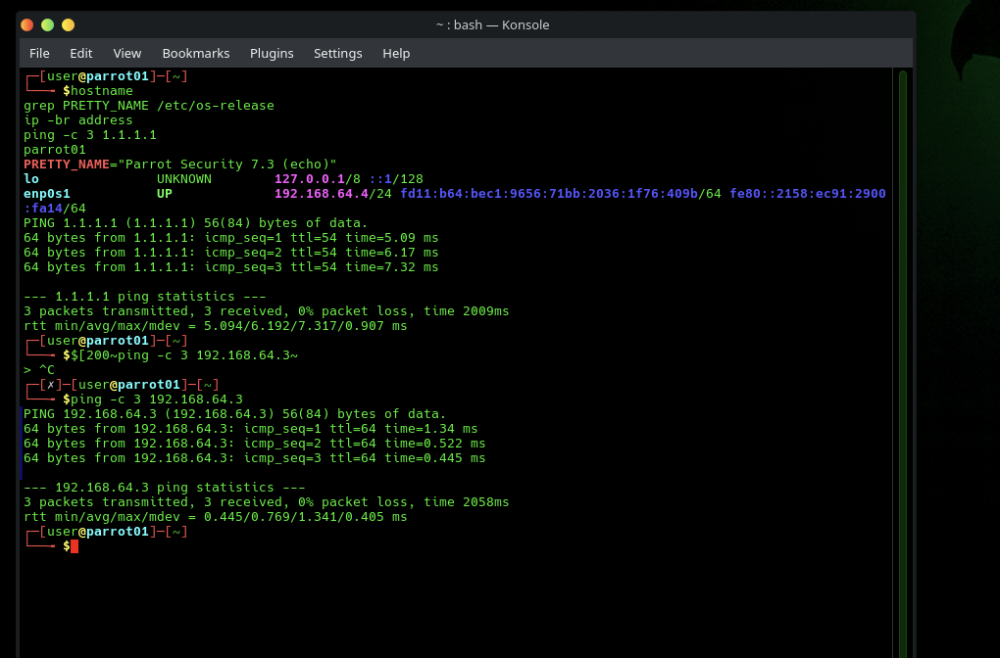

### Testing Step 3: Scanned the open services

I used Nmap to identify the network services exposed by the server:

```bash
nmap -sV 192.168.64.3
```

I ran an Nmap service-and-version scan to see the server the way another computer on the network would see it. Nmap found SSH on port 22, HTTP on port 80, and HTTPS on port 443; the other 997 tested ports were filtered. MySQL port 3306 was absent, which meant the firewall and local-only MySQL configuration were working as intended.

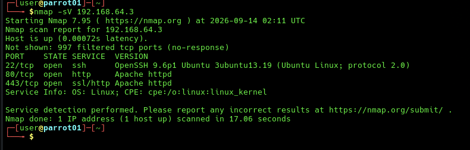

### Testing Step 4: Scanned the website

I used Nikto to check the HTTPS website for common web-server weaknesses and missing security settings:

```bash
nikto -h https://192.168.64.3
```

I ran Nikto to look for common web-server weaknesses and missing protections. It reported eight items, including missing CSP, Permissions Policy, and HSTS headers, plus a certificate-name mismatch. This meant there were recommendations to review, not that Nikto had compromised the server; the certificate mismatch was expected because I scanned the IP address while the lab certificate was issued to `lamp01`.

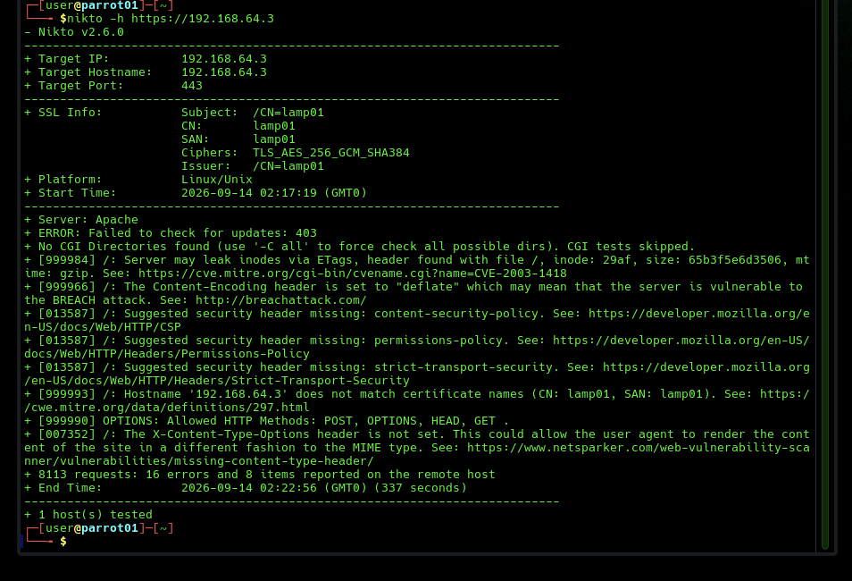

### Testing Step 5: Verified a scanner finding manually

Nikto claimed that the `X-Content-Type-Options` header was missing. I checked the server response manually:

```bash
curl -kI https://192.168.64.3/
```

I ran `curl` to view the real HTTPS response headers instead of trusting the automated alert without verification. The response contained `X-Content-Type-Options: nosniff`, `X-Frame-Options`, and `Referrer-Policy`. This meant the header was present and Nikto's missing-header alert was a false positive for the page I tested.

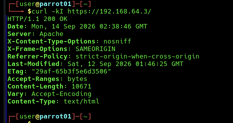

### Testing Step 6: Checked HTTPS encryption

I used an Nmap script to list the TLS versions and encryption ciphers accepted by port 443:

```bash
nmap --script ssl-enum-ciphers -p 443 192.168.64.3
```

I ran Nmap's SSL cipher script to check the encryption available on HTTPS port 443. The server accepted TLS 1.2 and TLS 1.3, and Nmap graded every displayed cipher `A`, with a least strength of `A`. This meant the server was not offering the older TLS 1.0 or 1.1 protocols and its available encryption passed this lab check.

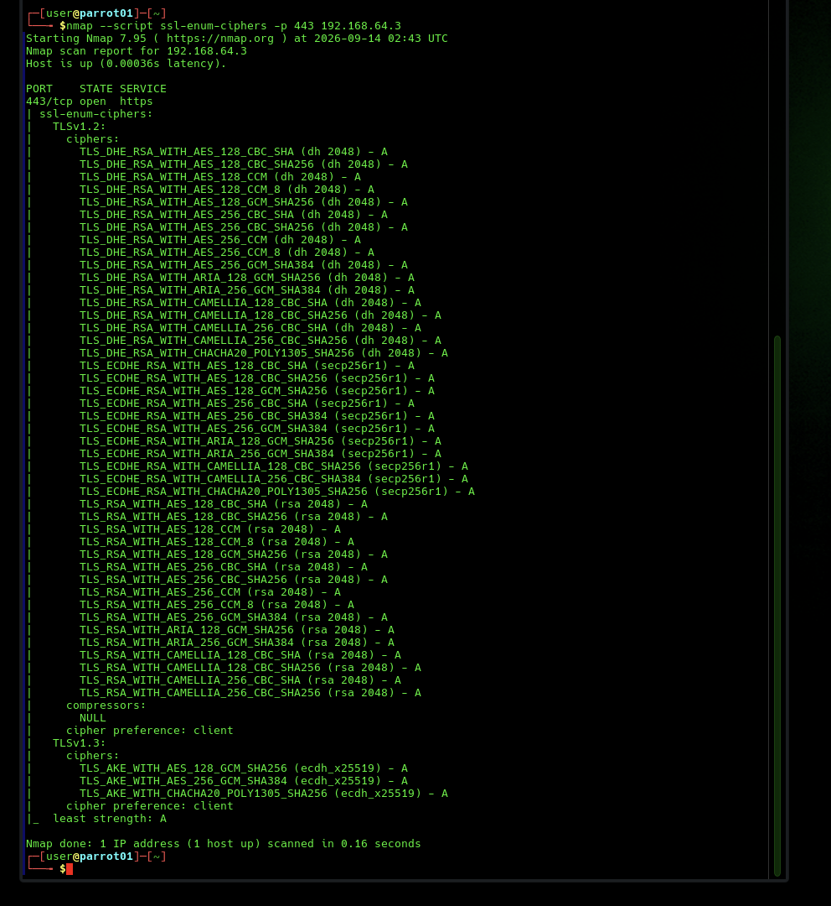

### Testing Step 7: Attempted remote access to MySQL

I attempted to connect from Parrot to MySQL port 3306:

```bash
nc -vz -w 3 192.168.64.3 3306
```

I ran this to test whether another computer could reach the database directly. The connection timed out. This meant the firewall blocked remote access to MySQL as intended.

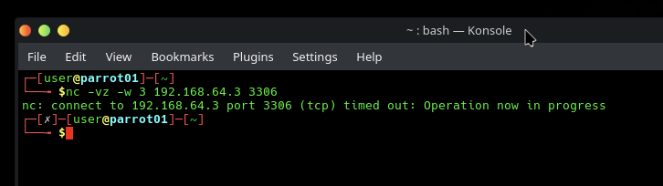

### Testing Step 8: Attempted a TRACE request

I sent an HTTPS request using the TRACE method that I had disabled during Apache hardening:

```bash
curl -k -i -X TRACE https://192.168.64.3/
```

The server returned `405 Method Not Allowed`. This meant Apache rejected the TRACE request and the hardening setting worked.

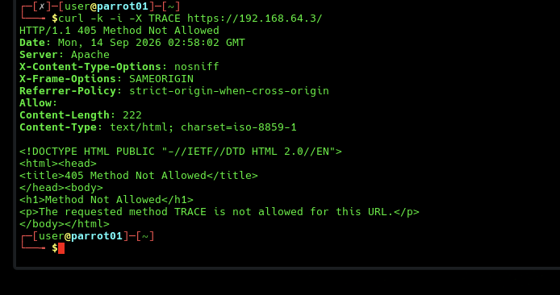

### Testing Step 9: Simulated repeated failed SSH logins

From Parrot, I attempted to connect to SSH and deliberately entered an incorrect password three times:

```bash
ssh aliaops@192.168.64.3
```

SSH rejected the passwords and disconnected Parrot with `Too many authentication failures`.

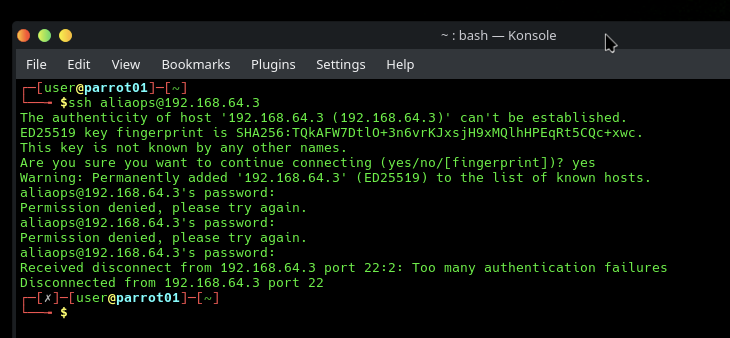

From the LAMP server console, I checked Fail2ban:

```bash
sudo fail2ban-client status sshd
```

Fail2ban showed one banned address and identified `192.168.64.4`, the Parrot VM. This meant Fail2ban detected the repeated failures and blocked the source as intended.

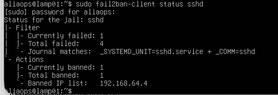

After recording the result, I removed the deliberate lab ban and confirmed that the banned count returned to zero.

```bash
sudo fail2ban-client set sshd unbanip 192.168.64.4
sudo fail2ban-client status sshd
```

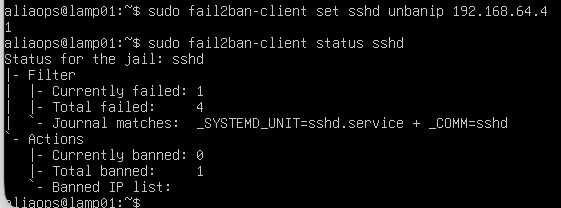

### Testing summary

My final result was a working LAMP server with only the intended services exposed. The firewall blocked a direct MySQL connection, Apache rejected the disabled TRACE method, and Fail2ban blocked Parrot after repeated failed SSH passwords. The configured headers were present, and HTTPS supported TLS 1.2 and TLS 1.3 with `A`-rated ciphers. I also learned that scanner output must be investigated because an automated tool can report a false positive.

For a future production deployment, I would replace the self-signed certificate with a trusted certificate, add application-tested CSP and Permissions Policy headers, enable HSTS after trusted HTTPS is in place, and replace SSH password login with SSH keys. These are documented next steps rather than hidden limitations. This server remains a learning environment, not a production system.

## Reference

The original LAMP installation steps were based on [A Step-by-Step Guide on How to Set Up and Deploy a LAMP Stack on a Linux Server](https://dev.to/ibrahimbioabu/a-step-by-step-guid-on-how-to-set-up-and-deploy-a-lamp-stack-on-a-linux-server-19jh). The security steps were added for the hardening portion of the home lab.
